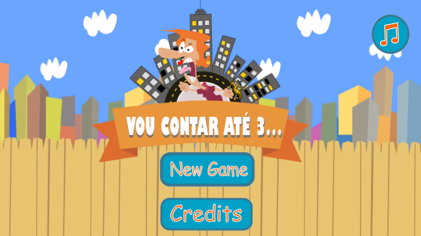
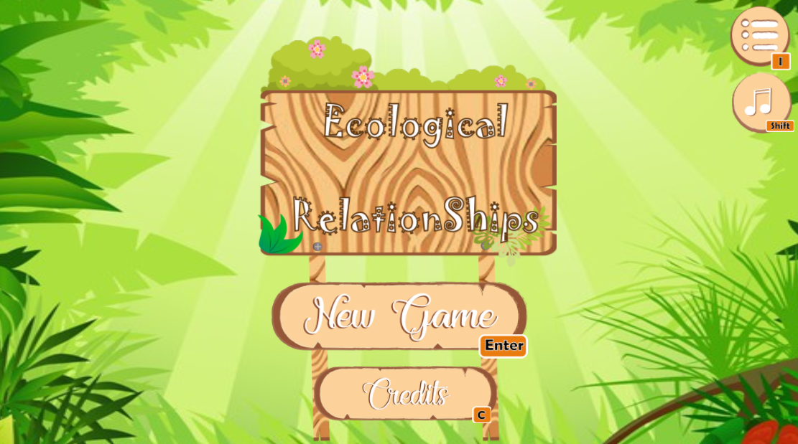
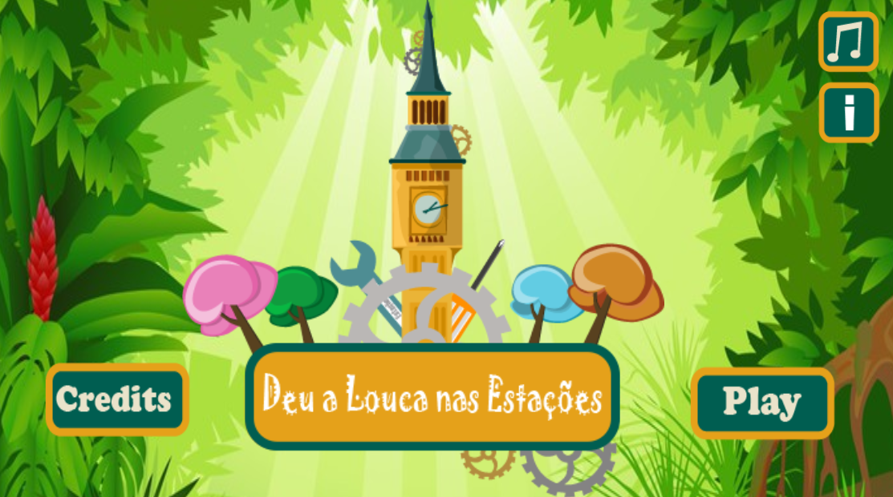
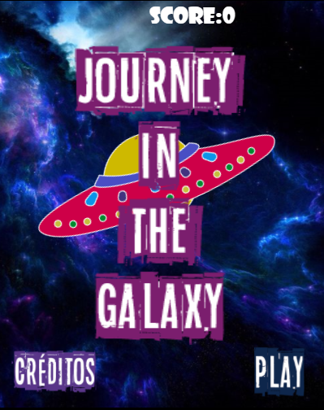
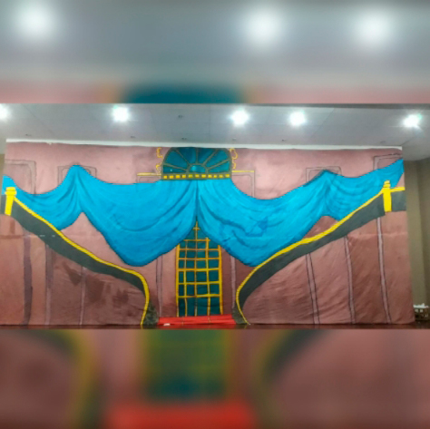
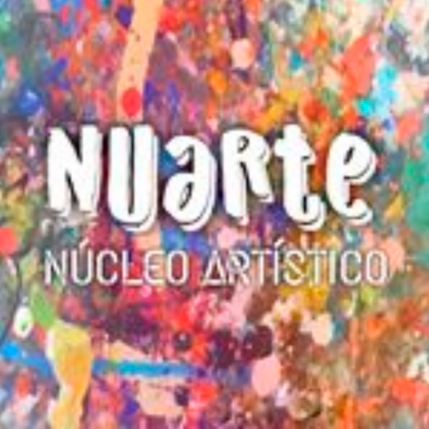
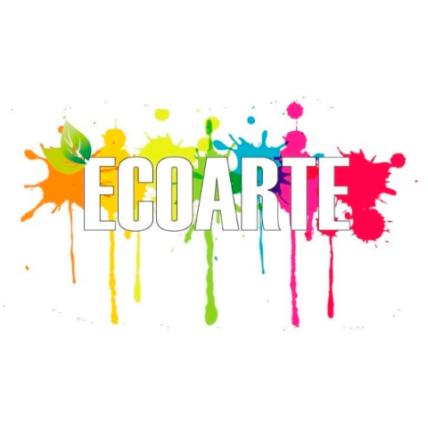
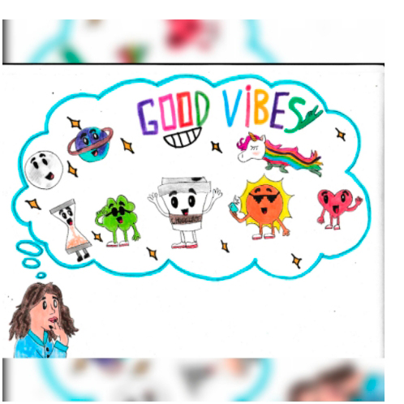

## Meu Portefólio

 

- Maciel Araujo de lima
 
- 22 anos

- Estudante do IFRN-Ceará-Mirim

- Game designer & Designer

## Quem sou eu?
- Olá Amigo(a) Prazer, Meu nome é Maciel Araújo e tenho 22 anos, sou estudante do Curso de Jogos Digitais na cidade de Ceará-Mirim, eu me considero uma pessoa muito criativa, meu sonho é fazer minha faculdade de Designer e abrir meu próprio negócio, me considero um bom Game Designer, adoro criar histórias, me sinto bem a vontade criando meus mundo imaginários e podendo dar vida a eles em formas de desenhos ou criando meus jogos mesmo.
- Sim já ia me esquecendo, adoro desenhar, um dos meus primeiros robes antes de entrar no curso de jogos era desenhar.então espero que tenha me conhecido um pouco e se divirta com meus trabalhos, tanto quanto eu me divertir criando.

## Jogos
### 01. jogo

**DESCRIÇÃO :_Este jogo conta a história de Guilherme, que desobedeceu a sua mãe e as consequências não foram uma das melhores, então que saber o que aconteceu com ele, vem aqui e dá uma jogadinha para descobrir._
### 02. jogo

**DESCRIÇÃO :_Este jogo conta a história de uma borboleta zaza, e sua amiga abelha zuzu, que juntas irão colectar sua comida e se livrar das ameaças dos seus predadores._
### 03. jogo

**DESCRIÇÃO :_Este jogo conta a história de um gnomo chamado ADOLFO, que cuidava de seu planeta tranquilo até certo dia....porque em um dia qualquer, uma nave espacial perde o controlo e cai em cima do relógio central, onde ele é responsável pelo equilíbrio das temperaturas das quatro estações, então ADOLFO tem que ir em busca das peças para concertar o relógio antes que todo o planeta se destrua por completo._

### 04. jogo

## Jogos Extras
### 01. jogo

**DESCRIÇÃO :_Este jogo conta a história de uma spaçonave que entra em uma trajetória errada, e vai parar em uma trajetória onde tem você tem que desviar dos cristais para não explodir no meio do espaço._

### Projetos

 

**DESCRIÇÃO :_Este foi um projeto na matéria de física, onde ele foi apresentado 2 anos consecutivos na expotec do IFRN CEARÀ-MIRIM, onde explicamos a importância dos lançamentos de foguetes e por fim, fazemos um experimento, onde criamos uma replica de uma foguete em escala reduzida com matérial de baixo custo, junto com os envolvidos do evento e lançamos no campo de esporte da instituição._

**DESCRIÇÃO :_Diretor geral do grupo CENÁRIO de um Musical, Onde toda a turma se reuni-o durante 1 ano, para ao final apresentarmos o nosso grande musical "O REINO DE MERLIM", onde nós se reunimos e criamos durante essa trajetória todo cenário que seria utilizado em cena._

**DESCRIÇÃO :_Projeto da professora de artes do campus Ceará-mirim, onde busca criar um espaço artítico e cultural para os alunos do campus, e nosso trabalho e cuidar do espaço e auxilar as turmas envolvidas._

**DESCRIÇÃO :_Projeto com parceria do NUARTE, onde ensinamos aos alunos e pessoas externas no campus, como criar um eco-sistema mais sustentável para as futuras gerações._

**DESCRIÇÃO :_Concurso oferecido pela "FABER CASTELL", onde deveriamos escultar uma música e criar um desenho, para ser apresentado no video clip da música, de brinde você ganha um estojo com 24 cores, referente a promoção._

# Contatos

